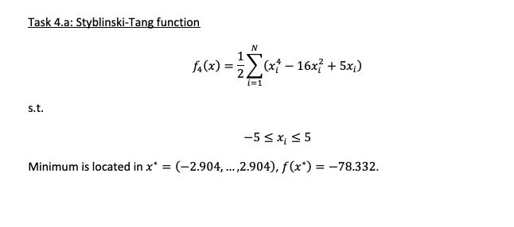
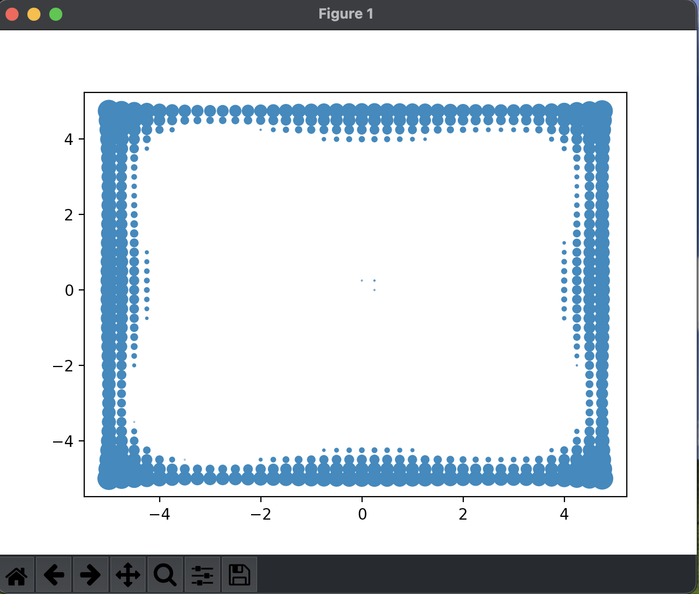
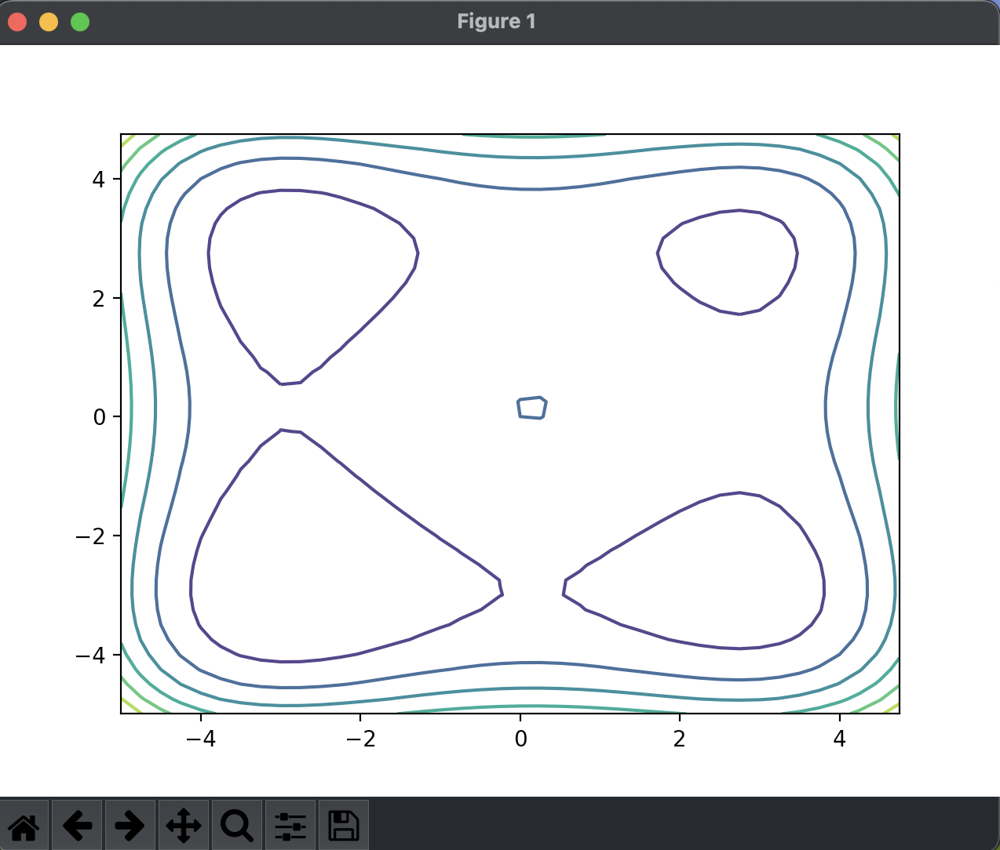

# Optimization Methods: Theory and Applications

## Introduction
I'm Tural Hajiyev with index number **270010**. Based of task number calculation, my task number is **4**

```
Task 4.
  a) Styblinski-Tang function
  b) Period function
```

I took first part of task to optimize and finish my project.



## Part 1

As a first part of project, I wrote computer application which calculates the value of `Styblinkski-Tang function`. I used 2 libraries for the first part of project:

```
import numpy as np;
import matplotlib.pyplot as plt;
```
1. **numpy** - Calculate the optimization problem.
2. **matplotlib.pyplot** -- Draw surface plot and contour plot of function with 2 variables.

After importing necessary packages, we need to create figure, arrange values for `x and y` values and calculate the function.

```
# Create a new figure
fig = plt.figure();
# Create new 3d polar axe
ax = fig.gca(projection='3d');
# return evenly spaces values for given array for x axis
x = np.arange(-5, 5, 0.25)
# return evenly spaces values for given array for y axis
y = np.arange(-5, 5, 0.25)
# convert x and y to cordinate matrices
x, y = np.meshgrid(x, y)
# styblinski-tang function
z = 0.5 * ((x**4 + y**4) - 16 * (x**2 + y**2)+ 5 * (x + y))
```

To show the plot, we need to pass the `x,y,z` values and use `show()` function of plot.

```
surface = ax.plot_surface(x, y, z, cmap='gist_earth')
# show figure
plt.show()
# draw contour lines for x,y,z points
plt.contour(x,y,z)
# show figure
plt.show();
# scatter plot for x, y and z 
plt.scatter(x, y, z);
# show figure
plt.show()
```

Final result




## Part 2

For the third part of the laboratory, we need to implement gradient optimization method of function. We're using Nelder-Mead optimization method and gradient-descent to implement gradient optimization.

### Nelder-Mead optimization method
As the first step, we need to import required packages

```
from scipy.optimize import minimize
from numpy.random import rand
from numpy import exp, arange, meshgrid
from matplotlib import pyplot
```

We need to define our `Styblinski-Tang function` function, with single value and double values.

```
# Single value
def objective(v):
    x, y = v
    return 0.5 * ((x**4 + y**4) - 16 * (x**2 + y**2)+ 5 * (x + y))

## Double values
def objective1(x, y):
    return 0.5 * ((x**4 + y**4) - 16 * (x**2 + y**2)+ 5 * (x + y))
```

After implementing our functions, we need to define minimum and maximum of values. We are iterating from -5 to +5 with 0.1 step:
```
r_min, r_max, step = -5.0, 5.0, 0.1
```


Implementation of function:
```
## Implement gradient method to calculate the result
pt = r_min + rand(2) * (r_max - r_min)

## Call Nelder-Mead optimization method
result = minimize(objective, pt, method='Nelder-Mead')

## Print the total amount of evaluations
print('Total Evaluations: %d' % result['nfev'])

## Print the best solution
evaluation = objective(result['x'])
print('Solution: f(%s) = %.5f' % (result['x'], evaluation))
```

Final results:
```
Total Evaluations: 50
Solution: f([ 2.74683117 -2.90351299]) = -64.19561
```


## Part 3 

For the third part of the laboratory, we need to implement gradient optimization method of function. We're using Newton-CG optimization method and gradient-descent to implement gradient optimization.

### Newton-CG optimization method
As the first step, we need to import required packages

```
from scipy.optimize import minimize
from numpy.random import rand
```

We need to define our `Styblinski-Tang function` function, with single value and double values.

```
# Single value
def objective(v):
    x, y = v
    return 0.5 * ((x**4 + y**4) - 16 * (x**2 + y**2)+ 5 * (x + y))

# Derivative function
def objective_derivative(x):
    return 0.5 * (4 * x**3 - 32 * x + 5)

## Double values
def objective1(x,y):
    return 0.5 * ((x**4 + y**4) - 16 * (x**2 + y**2)+ 5 * (x + y))
```


After implementing our functions, we need to define minimum and maximum of values. We are iterating from -5 to +5 with 0.1 step:
```
r_min, r_max, step = -5.0, 5.0, 0.1
```


Implementation of function:
```
## Implement gradient method to calculate the result
pt = r_min + rand(2) * (r_max - r_min)

## Call Newton-CG optimization method
result = minimize(objective, pt, method='Newton-CG')

## Print the total amount of evaluations
print('Total Evaluations: %d' % result['nfev'])

## Print the best solution
evaluation = objective(result['x'])
print('Solution: f(%s) = %.5f' % (result['x'], evaluation))
```

Final results:
```
Total Evaluations: 11
Solution: f([ 2.74680277 -2.90353403]) = -64.19561
```

### Gradient-descent

### Dependencies

We're using 2 main packages, `pyplot` and `derivative`


### Function implementation

As a first stage, we need to define objective function and derivative of objective function.

```
# objective function
def objective(x):
    return 0.5 * (x**4 - 16 * x**2 + 5 * x)
```

For the derivative function, we are using scipy.misc.derivative function

```
# derivative of objective function
def objective_derivative(x):
	print(derivative(objective, x))
	return derivative(objective, x)
```

### Gradient descent function

Another function, which helps us to calculate and show plot is `gradient_descent`

First, we need to create 2 empy list to store solutions and scores. 

```
	solutions, scores = list(), list()
	solution = bounds[:, 0] + rand(len(bounds)) * (bounds[:, 1] - bounds[:, 0])

```

Based on the value of `n_iter` we are looping and updating solutions and scores

```
	for i in range(n_iter):
		# calculate gradient
		gradient = objective_derivative(solution)
		# take a step
		solution = solution - step_size * gradient
		# evaluate candidate point
		solution_eval = objective(solution)
		# store solution
		solutions.append(solution)
		scores.append(solution_eval)
		# report progress
		print('>%d f(%s) = %.5f' % (i, solution, solution_eval))
```

At the end of the function, we need to return solutions and scores

```
	return [solutions, scores]
```

To call the function, first we need to define range of input, iteration count and step size

```
    # define range for input
    bounds = asarray([[-5.0, 5.0]])
    # define the total iterations
    n_iter = 30
    # define the step size
    step_size = 0.1
```

Then we need to call our function and save solutions and scores
```
    # perform the gradient descent search
    solutions, scores = gradient_descent(objective, objective_derivative, bounds, n_iter, step_size)
```

We need to define input range at 0.1 increments and get results from the main function

```
    # sample input range uniformly at 0.1 increments
    inputs = arange(bounds[0,0], bounds[0,1]+0.1, 0.1)
    # compute targets
    results = objective(inputs)
```

### Handling pyplot and showing results

Last step is to use pyplot to show graphics 

```
    # create a line plot of input vs result
    pyplot.plot(inputs, results)
    # plot the solutions found
    pyplot.plot(solutions, scores, '.-', color='red')
    # show the plot
    pyplot.show()
```

Example results from function call:

```
[6.04658748]
>0 f([-0.86037522]) = -7.79892
[13.27147523]
>1 f([-2.18752274]) = -32.30152
[12.1896069]
>2 f([-3.40648343]) = -34.02133
[-28.86778063]
>3 f([-0.51970536]) = -3.42354
[9.49513685]
>4 f([-1.46921905]) = -18.61210
[16.72614065]
>5 f([-3.14183311]) = -38.10405
[-15.54113039]
>6 f([-1.58772008]) = -20.95879
[16.72325675]
>7 f([-3.26004575]) = -36.69719
[-21.1542289]
>8 f([-1.14462286]) = -12.48459
[15.52543847]
>9 f([-2.69716671]) = -38.47989
[1.01813209]
>10 f([-2.79897992]) = -38.98372
[-2.17031394]
>11 f([-2.58194852]) = -37.56570
[4.22237564]
>12 f([-3.00418609]) = -38.98502
[-9.66775906]
>13 f([-2.03741018]) = -29.68628
[14.10899921]
>14 f([-3.4483101]) = -33.05145
[-31.23028365]
>15 f([-0.32528174]) = -1.65407
[6.98510937]
>16 f([-1.02379267]) = -10.39538
[14.68691791]
>17 f([-2.49248447]) = -36.63360
[6.42576867]
>18 f([-3.13506133]) = -38.16575
[-15.23572888]
>19 f([-1.61148844]) = -21.43195
[16.69110563]
>20 f([-3.28059901]) = -36.38626
[-22.18539112]
>21 f([-1.0620599]) = -11.04276
[14.97289254]
>22 f([-2.55934915]) = -37.34751
[4.80204207]
>23 f([-3.03955336]) = -38.83147
[-11.11041845]
>24 f([-1.92851151]) = -27.65847
[15.15428834]
>25 f([-3.44394035]) = -33.15725
[-30.98009456]
>26 f([-0.34593089]) = -1.81501
[7.26023861]
>27 f([-1.07195475]) = -11.21238
[15.04382799]
>28 f([-2.57633755]) = -37.51266
[4.36776657]
>29 f([-3.01311421]) = -38.95082
```